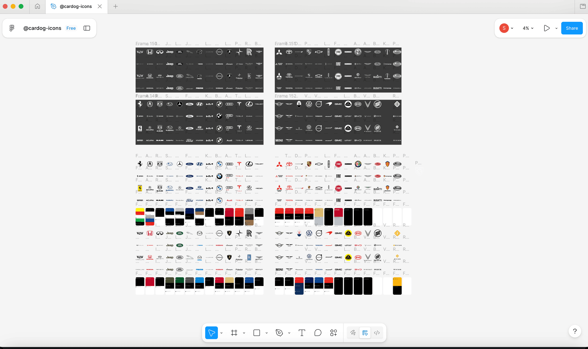

# Contributing to Cardog Icons

Thank you for your interest in contributing to Cardog Icons! This guide will help you add new car brand icons to the library.

## Figma Source

All icons are designed in Figma. You can view the source file here:

**[View Figma File](https://www.figma.com/design/b7pLzi42VHY1U51nuLL2tv/-cardog-icons?node-id=0-1)**

<a href="https://www.figma.com/design/b7pLzi42VHY1U51nuLL2tv/-cardog-icons?node-id=0-1">
  
</a>

A local copy (`@cardog-icons.fig`) is also included in the repo.

## Prerequisites

- [Figma](https://figma.com/) account
- [Node.js](https://nodejs.org/) 18+
- [pnpm](https://pnpm.io/) package manager

## Adding New Icons

### Step 1: Find Source Artwork

- Source logos from reputable sources (official brand websites, press kits, Wikipedia SVGs)
- **SVG only** - no PNGs or raster images
- Look for official brand guidelines when available

### Step 2: Design in Figma

Open the [Figma file](https://www.figma.com/design/b7pLzi42VHY1U51nuLL2tv/-cardog-icons?node-id=0-1) and follow the existing structure:

**Requirements:**
- **Frame size**: 512×512px for all icons
- **No gradients** - use flat colors only
- **Outline all text** - convert to paths
- **Merge shapes** - simplify where possible

**Create 8 variants per brand:**

| Category | Description | + Dark variant |
|----------|-------------|----------------|
| Icon | Square badge/emblem | Icon Dark |
| Logo | Full logo with emblem | Logo Dark |
| Logo Horizontal | Horizontal lockup | Logo Horizontal Dark |
| Wordmark | Text/name only | Wordmark Dark |

**Naming in Figma:**
```
{Brand} Icon
{Brand} Icon Dark
{Brand} Logo
{Brand} Logo Dark
{Brand} Logo Horizontal
{Brand} Logo Horizontal Dark
{Brand} Wordmark
{Brand} Wordmark Dark
```

**Dark variants:**
- Use `#FFFFFF` for all fills/strokes
- These will use `currentColor` in the final components

### Step 3: Export & Generate

```bash
# Export SVGs from Figma to core/raw/

# Optimize SVGs
pnpm optimize

# Generate React + React Native components
pnpm generate

# Build packages
pnpm build
```

### Step 4: Verify Locally

```bash
pnpm web
```

Open http://localhost:3000/icons and verify:
- All 4 categories render correctly
- Dark variants display properly in dark mode
- Icons scale correctly with the size prop

### Step 5: Submit PR

**One commit per brand** - this makes review easier.

```bash
git checkout -b add-{brand}-icons
git add .
git commit -m "feat: add {Brand} icons"
git push -u origin add-{brand}-icons
```

**Include screenshots** in your PR showing:
1. The icons on the dev web server (light mode)
2. The icons on the dev web server (dark mode)

Since this is a visual library, all PRs require manual review - there's no automated CI for icon validation.

## Project Structure

```
@cardog-icons/
├── @cardog-icons.fig    # Figma source file (local copy)
├── core/
│   ├── raw/             # Raw exported SVGs from Figma
│   ├── optimized/       # Optimized SVGs (auto-generated)
│   └── scripts/         # SVG optimization scripts
├── react/
│   ├── src/components/  # React components (auto-generated)
│   └── scripts/         # Component generation
├── react-native/
│   ├── src/components/  # React Native components (auto-generated)
│   └── scripts/         # Component generation
└── web/                 # Documentation website
```

## Scripts Reference

| Command | Description |
|---------|-------------|
| `pnpm optimize` | Optimize raw SVGs with SVGO |
| `pnpm generate` | Generate React + React Native components |
| `pnpm build` | Build all packages |
| `pnpm web` | Start documentation website |
| `pnpm build:all` | Full pipeline: optimize → build → generate |

## Questions?

Open an issue on [GitHub](https://github.com/cardog-ai/icons/issues) or check existing issues for guidance.
